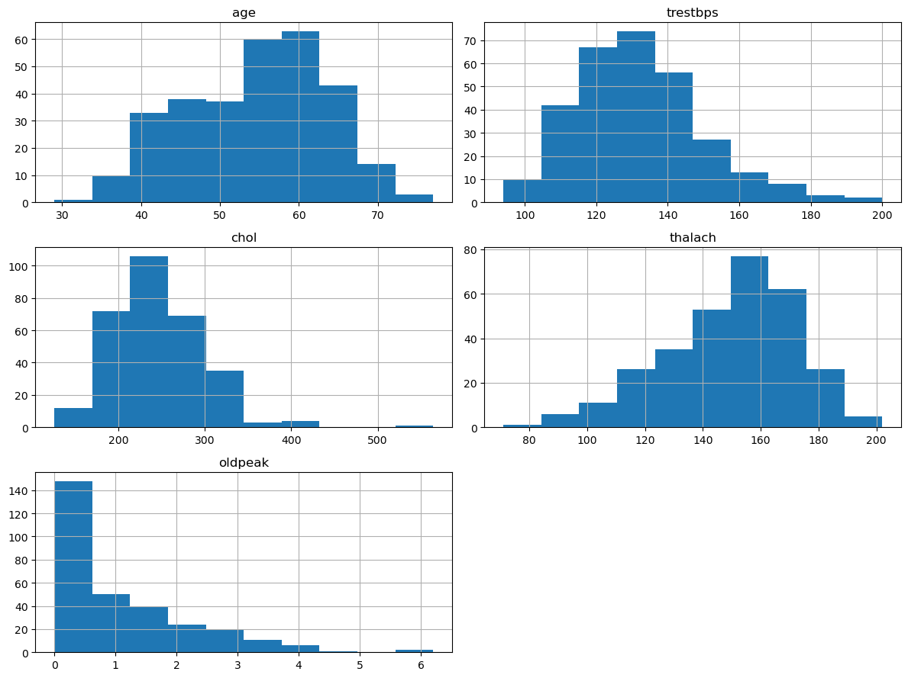
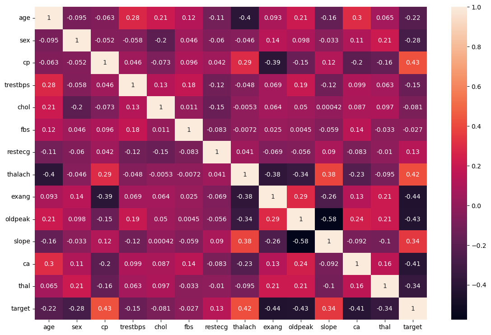

# Heart Disease Analysis

## Overview

This repository contains a Jupyter Notebook (`disease_analysis.ipynb`) that performs an exploratory data analysis (EDA) and builds a machine learning model to predict the likelihood of heart disease. The analysis leverages a comprehensive dataset containing various health indicators.

### Goals:

* Understand characteristics of the dataset and identify key features influencing heart disease.
* Preprocess the data for machine learning.
* Develop a predictive model for early detection or risk assessment of heart disease.

---

## Dataset

The analysis uses the `heart.csv` dataset, located in the `data/` directory. It contains the following features:

| Feature      | Description                                                      |
| ------------ | ---------------------------------------------------------------- |
| **age**      | Age of the patient                                               |
| **sex**      | Sex (1 = male, 0 = female)                                       |
| **cp**       | Chest pain type (0–3)                                            |
| **trestbps** | Resting blood pressure (mm Hg)                                   |
| **chol**     | Serum cholesterol (mg/dl)                                        |
| **fbs**      | Fasting blood sugar > 120 mg/dl (1 = true, 0 = false)            |
| **restecg**  | Resting electrocardiographic results (0–2)                       |
| **thalach**  | Maximum heart rate achieved                                      |
| **exang**    | Exercise-induced angina (1 = yes, 0 = no)                        |
| **oldpeak**  | ST depression induced by exercise                                |
| **slope**    | Slope of peak exercise ST segment                                |
| **ca**       | Number of major vessels (0–3) colored by fluoroscopy             |
| **thal**     | Thalassemia type (e.g., normal, fixed defect, reversible defect) |
| **target**   | Heart disease diagnosis (0 = less likely, 1 = more likely)       |

**Note:** The original dataset had 1025 rows; after removing duplicates, 302 rows remained.

---

## Project Structure

```
.
├── data/
│   └── heart.csv
└── disease_analysis.ipynb
```

---

## Setup & Installation

1. **Clone the repository:**

   ```bash
   git clone <repository_url>
   cd <repository_name>
   ```

2. **Create and activate a virtual environment:**

   ```bash
   python -m venv venv
   # On Windows:
   .\venv\Scripts\activate
   # On macOS/Linux:
   source venv/bin/activate
   ```

3. **Install dependencies:**

   ```bash
   pip install pandas numpy matplotlib seaborn jupyter
   ```

4. **Place the dataset:**

   Ensure the `heart.csv` file is in the `data/` directory.

---

## Usage

1. **Launch Jupyter Notebook:**

   ```bash
   jupyter notebook
   ```

2. **Open `disease_analysis.ipynb`** in your browser and run the cells sequentially.

---

## Key Steps in the Notebook

1. **Loading Data**
   Read `heart.csv` into a DataFrame.

2. **Initial Inspection**
   Show first and last few rows, shape, `.info()`.

3. **Check Missing Values**
   Confirm no nulls are present.

4. **Remove Duplicates**
   Eliminate duplicate rows.

5. **Descriptive Statistics**
   Summary via `.describe()`.

6. **EDA**

   * Histograms for numerical features
   * Correlation heatmap
   * Relationship plots between features and target

7. **(Optional) Feature Engineering**
   Could include scaling, encoding, etc.

8. **Model Building**
   Trains and evaluates a classifier (details in notebook).

---

## Visualizations

### Distribution of Key Features


Histograms reveal distributions of:

* `age`
* `trestbps`
* `chol`
* `thalach`
* `oldpeak`

Example: `age` is normally distributed around 50–60; `oldpeak` is right-skewed.

### Correlation Heatmap


Shows feature relationships.
Notable correlations:

* `cp` and `thalach` positively correlate with `target`
* `exang` and `oldpeak` negatively correlate

---

## Contributing

Feel free to fork, improve, and submit pull requests. For major changes, please open an issue first.

---

